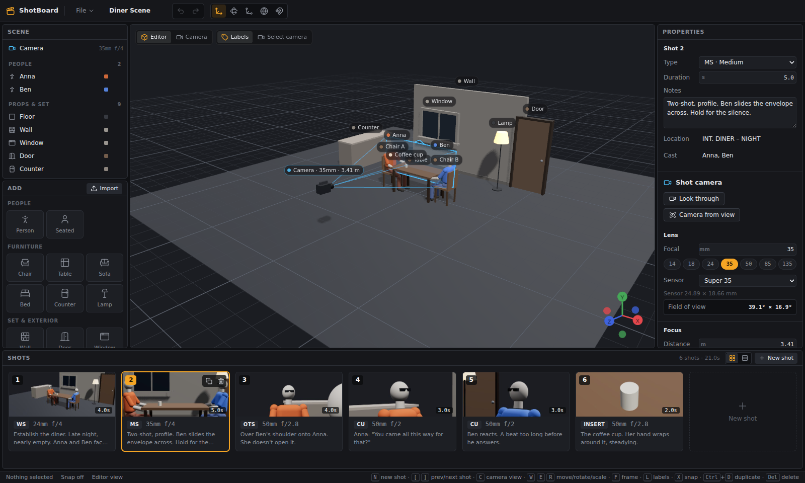

# ShotBoard

A storyboard and shot list tool with a simple 3D stage. Block a scene with simple figures and props, frame it with a real lens, and save each frame as a shot.

See [docs/ARCHITECTURE.md](docs/ARCHITECTURE.md) for the design and data model.



## Status

All six milestones are built: viewport and gizmos, lens and camera view, shots and saving, keyframes and timeline, lighting, and export.

## Install

Needs **Node.js 20+**. **Python 3.11+** is needed only for PDF and MP4 export. ffmpeg is optional; a bundled copy is used if it isn't installed.

```bash
cd shotboard
./scripts/setup.sh            # macOS / Linux
# or, on Windows (PowerShell):
powershell -ExecutionPolicy Bypass -File scripts\setup.ps1
```

The setup script installs the npm packages, creates `server/.venv` with the export helper's Python packages, and checks for ffmpeg.

## Run it

```bash
npm run dev        # the desktop app (it starts the export helper by itself)
```

`npm run web` runs only the UI in a browser at http://localhost:5199, which is handy for quick UI work. In that mode, start the export helper separately with `npm run server`.

If the 3D view won't start on a machine without a working GPU (a VM, for example), launch with `SHOTBOARD_SOFTWARE_GL=1 npm run dev`.

## Checks

```bash
npm run typecheck       # TypeScript
npm test                # unit tests (undo/redo, lens math, camera moves, lighting, shot list, project files)
npm run test:server     # export helper tests (pytest): token check, PDF layouts, a real MP4 encode
npm run smoke           # drives the whole UI in headless Chromium, saves screenshots to test-output/
npm run test:export     # end to end: exports a PDF, stills and an MP4 from the sample project and checks them
npm run smoke:electron  # Linux: launches the real desktop app under xvfb and saves a screenshot
```

## Using it

To look around first, open **File → Open sample project**: a six-shot diner scene. The same project is also saved as `samples/Diner-Scene.shotboard`.

**Build the scene.** The Add panel has people, furniture, set pieces and basic shapes, at real-world sizes. New things appear where you're looking. Each new person gets their own shirt color, and name labels float above everything (press **L** to hide them). To bring in your own models, use **Import** or drop a `.glb`/`.gltf` file on the 3D view.

**Pose people.** Select a person and pick a pose (Stand, Sit, Walk, Run, Point). To adjust, click one of the white dots on the figure (or a joint name in Properties) and drag the rings. The dark band on the face shows which way they're looking.

**Frame the shot.** The blue camera and its view cone show what the shot camera sees. Press **C** to look through it. In camera view:
- Drag to orbit around the focus point, right-drag to pan, and scroll to dolly.
- **F** aims the camera at whatever is selected.
- The bar at the top sets the aspect ratio, guides and depth of field.

In the editor view, **Camera from view** puts the shot camera where you're looking from.

**Shots.** Each shot is its own frame with its own set, people and camera. **New shot** (N) copies the current one so you can adjust from there. The Shots panel at the bottom has two views:
- **Storyboard grid:** thumbnails rendered through each shot's camera, which update as you work. Drag to reorder, and hover a card to duplicate or delete it.
- **List:** a table you can edit directly. **Columns** lets you show, hide and reorder columns, and add your own (text, number or a choice list).

Shots are numbered automatically. Type your own number (like "12A") to keep it, or clear it to go back to automatic. With nothing selected, Properties shows the shot's type, duration, notes and your custom fields.

**Camera moves.** The timeline under the 3D view belongs to the current shot. There are three ways to build a move:
- **Moves** adds a preset that runs for the whole shot: dolly, truck, pan, tilt, crane, orbit, zoom, or dolly zoom (the "Vertigo" effect). There's an Amount slider.
- Press **K** to add a keyframe at the playhead.
- Once a shot has a keyframe, scrub to another time and move the camera (gizmo, camera view, or Properties). That records a keyframe there automatically.

To edit keys, click one to change its easing or delete it, or drag it to change its timing. **Handheld** adds a repeatable camera shake, which shows when playing.

**Playing.** **Space** plays the current shot. **Shift+Space** or **Play all** plays every shot in order through the camera, as an animatic. Playback follows real time and drops frames on a slow machine rather than running slow.

**Lighting.** With nothing selected, Properties has a **Lighting** section:
- **Presets:** Golden hour (low warm sun, cool shadows), Overcast (soft, even daylight), Night (blue ambience, a warm practical and cool moonlight), and 3-point (key, fill and back light on a dark stage). Presets place their lights around whatever the camera is focused on. Applying another preset replaces those lights rather than adding more.
- **Setting:** Studio, Day, Overcast, Sunset, Night or Dark stage. This sets the sky, sun and ambient light.
- **Background and exposure:** a sky or a flat colour behind the set, and exposure in stops.
- **Use this lighting in all shots** keeps the whole scene consistent.

You can also add your own lights from the Add panel: Spot, Soft panel, Practical (bulb) and Sun. Each has brightness, colour temperature in Kelvin (with Candle, Tungsten, Daylight and Shade presets), a tint, the beam angle or panel size, and shadows. A light shines the way it points, so rotate it with **E** to aim it.

Ambient occlusion (soft shading where objects meet) is on by default. Turn it off with the **AO** button on slow machines. Click a section title in Properties to fold it away.

**Export.** Click **Export** in the toolbar (Ctrl+E):
- **Shot list PDF:** a storyboard sheet (3×2 frames per page with number, type, lens, length, notes and your columns), or a table. Letter or A4.
- **Stills:** a ZIP with one PNG per shot, HD or 4K.
- **Animatic MP4:** every shot in order with its camera moves and shake, at 960, 1280 or 1920 wide. Shot number, type, lens and timecode can be burned in.

Every export is rendered through each shot's own camera. Depth of field and ambient occlusion are shown in the viewport only, not in exports.

**Saving.** **File → Save** writes one `.shotboard` file. It contains the shots, thumbnails and any imported models, so you can send it to someone. Each save keeps the previous version next to it as `.shotboard.bak`. Unsaved work is autosaved every 30 seconds. If the app closes before you save, it offers to recover your work the next time it starts.

**Lens.** With nothing selected, Properties shows the camera. Set the focal length, sensor (Super 35, Full Frame, Alexa 65, iPhone), f-stop and focus. **Focus on** pulls focus to a person or prop. The field of view and the in-focus range are calculated the way a real lens works.

## Controls

| Key | Action |
|---|---|
| Left-drag / right-drag / scroll | Orbit / pan / zoom (in camera view this moves the shot camera) |
| Click, Shift+click | Select, add to selection |
| Space / Shift+Space | Play shot / play all shots |
| K | Add a camera keyframe at the playhead |
| ← / → (Shift: 1 s) | Step one frame |
| Home / End | Start / end of shot |
| N | New shot (copy of the current one) |
| [ / ] | Previous / next shot |
| Ctrl+S / Ctrl+Shift+S | Save / Save as |
| Ctrl+O / Ctrl+N | Open / New project |
| C | Editor view / camera view |
| W / E / R | Move / rotate / scale |
| Q | World / local space |
| X | Snap on/off (0.25 m, 15°, 0.1) |
| F | Frame selection (camera view: aim the camera at it) |
| L | Name labels on/off |
| G | Rule-of-thirds guide on/off |
| Ctrl+D | Duplicate |
| Del | Delete (the selected keyframe first, else objects) |
| Ctrl+Z / Ctrl+Shift+Z | Undo / redo |
| Esc | Stop playback, leave joint posing, then clear the selection |
| ? | Show all keyboard shortcuts |

In Properties, drag a field's label left or right to scrub the value. Hold Shift for fine changes and Ctrl for coarse ones. Double-click an item in the scene list to rename it.

## Troubleshooting

- **"Export helper isn't running"**: run the setup script, or check that `server/.venv` exists. The desktop app finds it there. To use a different Python, set `SHOTBOARD_PYTHON=/path/to/python`.
- **Slow in a VM or remote desktop:** turn off **AO** in the viewport toolbar, and use Draft size for animatics.
- **Project won't open:** the error message says why. If the app closed unexpectedly, the next launch offers to recover from autosave, and each save keeps the previous version as `*.shotboard.bak`.

## Not in this version

Camera keyframes only (people and props don't animate yet). There's no IK posing, collaboration, FBX import (convert to `.glb`), script import, or signed installers. "Send to Blender" is a possible next step.
