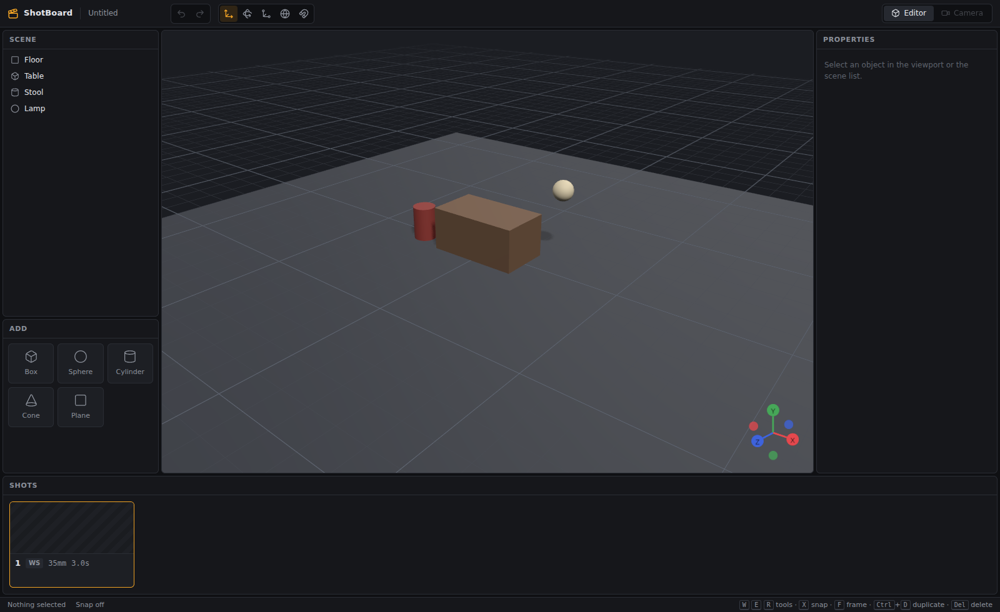

# ShotBoard

A storyboard and shot list tool with a simple 3D stage. Block a scene with simple figures and props, frame it with a real lens, and save each frame as a shot.

See [docs/ARCHITECTURE.md](docs/ARCHITECTURE.md) for the design and data model.



## Status

| Milestone | State |
|---|---|
| 1. Viewport and gizmos | Done |
| 2. Lens and camera view | Next |
| 3. Shots and saving | |
| 4. Keyframes and timeline | |
| 5. Lighting and polish | |
| 6. Export (PDF, PNG, MP4) | |

## Run it

Needs Node 20 or newer.

```bash
cd shotboard
npm install
npm run dev        # opens the desktop app with hot reload
```

`npm run web` runs only the UI in your browser at http://localhost:5199. It's handy for quick UI work.

## Checks

```bash
npm run typecheck  # TypeScript
npm test           # unit tests (undo/redo, commands)
npm run smoke      # drives the UI in headless Chromium, saves screenshots to test-output/
npm run smoke:electron  # Linux only: launches the real app under xvfb and saves a screenshot
```

If the 3D view won't start on a machine without a working GPU (a VM, for example), launch with `SHOTBOARD_SOFTWARE_GL=1 npm run dev`.

## Controls

| Key | Action |
|---|---|
| Left-drag / right-drag / scroll | Orbit / pan / zoom |
| Click, Shift+click | Select, add to selection |
| W / E / R | Move / rotate / scale |
| Q | World / local space |
| X | Snap on/off (0.25 m, 15°, 0.1) |
| F | Frame selection (or everything) |
| Ctrl+D | Duplicate |
| Del | Delete |
| Ctrl+Z / Ctrl+Shift+Z | Undo / redo |
| Esc | Clear selection |

In the properties panel, drag a field's X/Y/Z label left or right to scrub the value. Hold Shift for fine changes and Ctrl for coarse ones. Double-click an item in the scene list to rename it.
